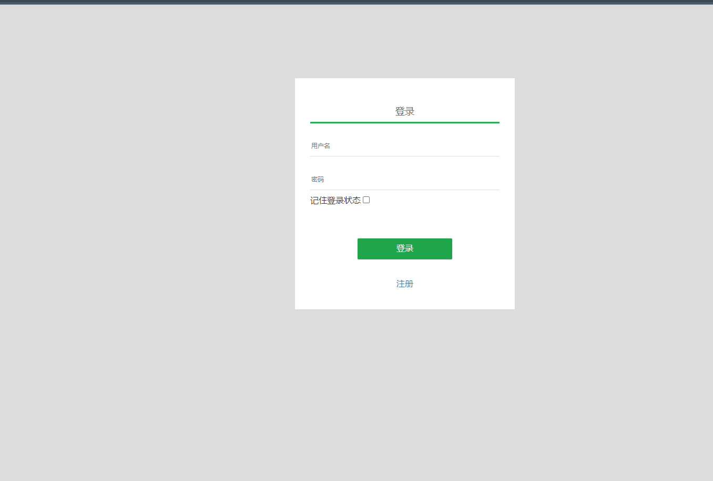
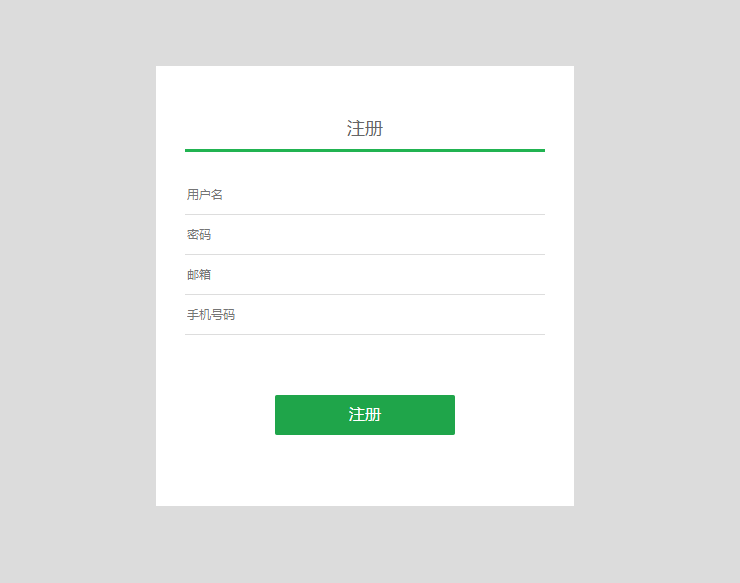
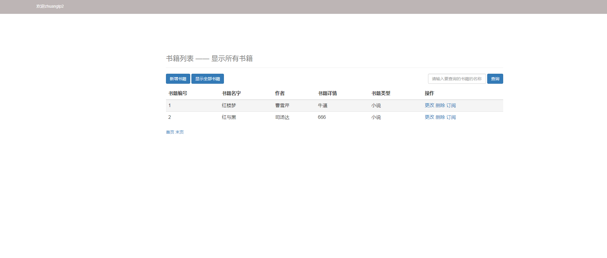
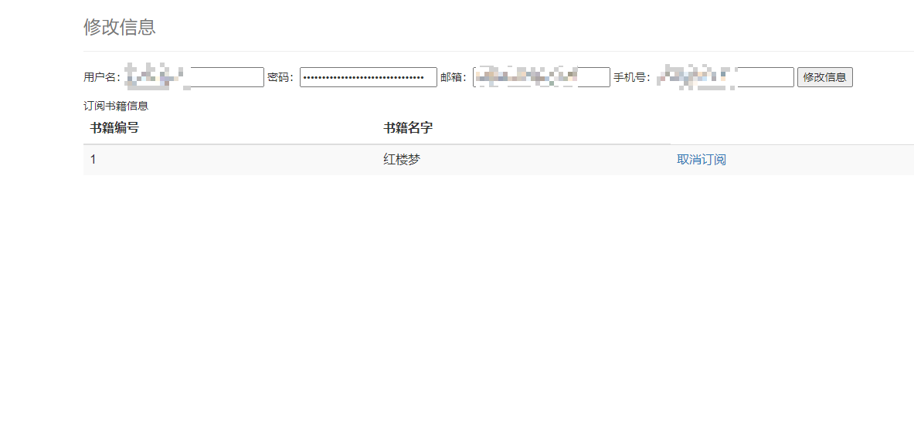
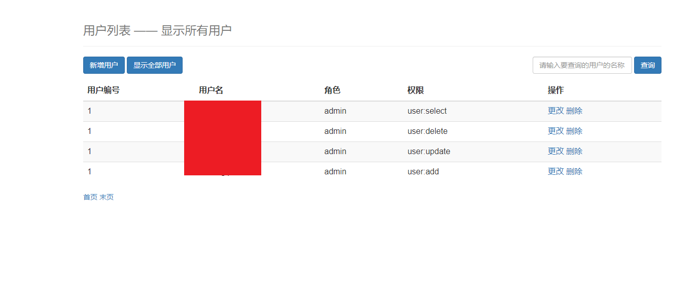

# 项目架构
框架基于spring MVC +Mybatis，权限框架用的是shiro，前端使用jsp技术
把之前初学java的demo整理下。

- Controller层有点乱

# 数据库脚本
dump-book-202309211645.sql

# 登录页面

# 注册页面
- 邮箱手机号前端做了正则效验
- 密码是md5加盐，盐字段是用户名

# 管理员主页
- 管理员才会显示增删改选项

# 个人中心

# 权限管理中心
- 未完成 后续更新

